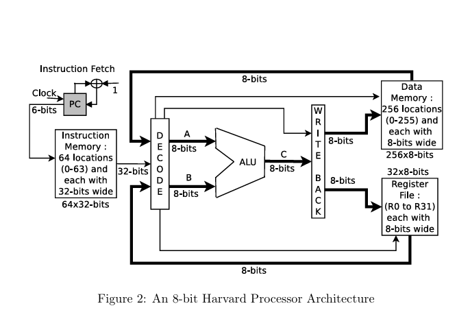

# 🖥️ Harvard Architecture 8-bit Processor — Verilog Implementation

A fully synthesizable, Harvard-architecture 8-bit processor designed and implemented in Verilog HDL.
The design features a custom ALU, instruction fetch/decode pipeline, register file, and data memory — all built from first principles using structural and behavioral Verilog.

---

## 📐 Architecture Overview

```
                         ┌─────────────────────────────────────┐
                         │           Instruction Fetch          │
          Clock ──►  PC ─►  Instruction Memory (64 × 32-bit)   │
                         └──────────────┬──────────────────────┘
                                        │ 32-bit instruction
                         ┌──────────────▼──────────────────────┐
                         │           Decode Unit                │
                         │  Reads register addresses from instr │
                         └──────┬───────────────┬──────────────┘
                                │               │
                      ┌─────────▼──┐    ┌───────▼──────┐
                      │   Reg A    │    │    Reg B     │
                      └─────────┬──┘    └───────┬──────┘
                                │               │
                         ┌──────▼───────────────▼──────┐
                         │              ALU             │
                         │  ADD · SUB · MUL · DIV · NEG│
                         │  OR · AND · XOR · NOT · NAND│
                         │  NOR · XNOR · LSHL · LRSH   │
                         └──────────────┬──────────────┘
                                        │
                         ┌──────────────▼──────────────────────┐
                         │            Write Back                │
                         │   Register File (32 × 8-bit)        │
                         │   Data Memory  (256 × 8-bit)        │
                         └─────────────────────────────────────┘
```

## 🏗️ Processor Architecture

<p align="center">
  
</p>

The processor follows a Harvard Architecture with:
- Separate instruction and data memory
- 32 × 8-bit register file
- Custom ALU supporting arithmetic and logic operations
- Dedicated fetch, decode, execute, and write-back stages

The ALU supports:
- ADD
- SUB
- MUL
- DIV
- NEG
- OR
- XOR
- NAND
- NOR
- XNOR
- NOT
- Logical Left Shift
- Logical Right Shift


---

## ✨ Features

| Feature | Specification |
|---|---|
| Architecture | Harvard (separate instruction & data memory) |
| Data width | 8-bit |
| Instruction width | 32-bit |
| Register file | 32 × 8-bit general purpose registers (R0–R31) |
| Instruction memory | 64 × 32-bit locations |
| Data memory | 256 × 8-bit locations |
| Program counter | 6-bit |
| ALU operations | 14 arithmetic + logic operations |

---

## 🗂️ Repository Structure

```
.
├── src/                        # RTL source files
│   ├── top.v                   # Top-level processor integration
│   ├── fetch_unit.v            # Instruction fetch & PC logic
│   ├── decode_unit.v           # Instruction decode unit
│   ├── write_back.v            # Write-back stage
│   ├── alu.v                   # ALU top-level (all operations)
│   ├── register_file.v         # Single-port register file
│   ├── register_file2.v        # Dual-port register file
│   ├── data_memory.v           # Data memory (256 × 8-bit)
│   │
│   ├── cla_8_bit.v             # 8-bit Carry Lookahead Adder (KGP + recursive doubling)
│   ├── sub_8_bit.v             # 8-bit Subtractor (2's complement via CLA)
│   ├── wallace_tree_multiplier.v  # 8×8 Wallace Tree Multiplier (16-bit result)
│   ├── non_rst_div.v           # Non-restoring 8-bit Divider
│   ├── eight_bit_neg.v         # Negation
│   ├── eight_bit_log_left.v    # Logical left barrel shifter
│   ├── eight_bit_log_right.v   # Logical right barrel shifter
│   ├── eight_bit_or.v          # Bitwise OR
│   ├── eight_bit_and.v         # Bitwise AND
│   ├── eight_bit_nand.v        # Bitwise NAND
│   ├── eight_bit_nor.v         # Bitwise NOR
│   ├── eight_bit_xor.v         # Bitwise XOR
│   ├── eight_bit_xnor.v        # Bitwise XNOR
│   └── eight_bit_not.v         # Bitwise NOT
│
├── tb/                         # Testbench files
│   ├── top_tb.v                # Full processor integration testbench
│   ├── alu_tb.v                # ALU testbench
│   ├── fetch_unit_tb.v         # Fetch unit testbench
│   ├── decode_unit_tb.v        # Decode unit testbench
│   ├── register_file_tb.v      # Register file testbench
│   └── data_memory_tb.v        # Data memory testbench
│
├── docs/
│   └── Harvard_8bit_Processor_Design.pdf   # Full problem statement & spec
│
├── sim/                        # Simulation output directory (.vcd waveforms)
├── Makefile                    # Build & simulation targets
└── README.md
```

---

## 🧮 Instruction Set Architecture

### Instruction Formats

| Format | Usage | Layout (32-bit) |
|---|---|---|
| Immediate MOV | `MOV Rdst, #Imm` | `[31:26] opcode │ [25:21] Rdst │ [20:8] — │ [7:0] Imm` |
| Register MOV | `MOV Rdst, Rsrc` | `[31:26] opcode │ [25:21] Rdst │ [20:5] — │ [4:0] Rsrc` |
| Load | `LOAD Rdst, [addr]` | `[31:26] opcode │ [25:21] Rdst │ [20:8] — │ [7:0] Src Addr` |
| Store | `STORE [addr], Rsrc` | `[31:26] opcode │ [25:18] Dst Addr │ [17:5] — │ [4:0] Rsrc` |
| ALU | `OP Rdst2, Rdst1, Rsrc2, Rsrc1` | `[31:26] op │ [25:21] Rdst2 │ [20:16] Rdst1 │ [15:10] — │ [9:5] Rsrc2 │ [4:0] Rsrc1` |

### Opcode Table

| Opcode | Mnemonic | Operation |
|---|---|---|
| `000000` | MOV (Imm) | `Rdst = Imm` |
| `000001` | MOV (Reg) | `Rdst = Rsrc` |
| `000010` | LOAD | `Rdst = MEM[addr]` |
| `000011` | STORE | `MEM[addr] = Rsrc` |
| `000100` | ADD | `Rdst1 = Rsrc2 + Rsrc1` |
| `000101` | SUB | `Rdst1 = Rsrc2 − Rsrc1` |
| `000110` | NEG | `Rdst1 = −Rsrc1` |
| `000111` | MUL | `{Rdst2, Rdst1} = Rsrc2 × Rsrc1` |
| `001000` | DIV | `Rdst1 = Rsrc2 / Rsrc1` |
| `001001` | OR | `Rdst1 = Rsrc2 \| Rsrc1` |
| `001010` | XOR | `Rdst1 = Rsrc2 ^ Rsrc1` |
| `001011` | NAND | `Rdst1 = ~(Rsrc2 & Rsrc1)` |
| `001100` | NOR | `Rdst1 = ~(Rsrc2 \| Rsrc1)` |
| `001101` | XNOR | `Rdst1 = ~(Rsrc2 ^ Rsrc1)` |
| `001110` | NOT | `Rdst1 = ~Rsrc1` |
| `001111` | LSHL | `Rdst1 = Rsrc2 << Rsrc1` |
| `010000` | LRSH | `Rdst1 = Rsrc2 >> Rsrc1` |

---

## 🔧 Key Hardware Modules

### CLA Adder (`cla_8_bit.v`)
Implements an 8-bit Carry Lookahead Adder using the **KGP (Kill-Generate-Propagate)** method with the recursive doubling algorithm for fast carry computation across 3 tree stages.

### Wallace Tree Multiplier (`wallace_tree_multiplier.v`)
8×8 unsigned multiplier producing a 16-bit result. Uses a CSA (Carry-Save Adder) reduction tree across 6 stages, culminating in a 16-bit CLA for the final addition.

### Non-Restoring Divider (`non_rst_div.v`)
8-bit non-restoring division algorithm across 8 iterative stages. Outputs an 8-bit quotient and 8-bit remainder. Handles divide-by-zero gracefully.

### Barrel Shifter (`eight_bit_log_left.v`, `eight_bit_log_right.v`)
3-stage 2:1 MUX-based logarithmic barrel shifter supporting shifts of 0–7 bits in a single combinational path.

---

## 🚀 Simulation

### Prerequisites
- [Icarus Verilog](http://iverilog.icarus.com/) (`iverilog`, `vvp`)
- [GTKWave](http://gtkwave.sourceforge.net/) (optional, for waveform viewing)

### Run all simulations
```bash
make all
```

### Run individual modules
```bash
make sim_alu        # ALU testbench
make sim_top        # Full processor integration
make sim_fetch      # Fetch unit
make sim_decode     # Decode unit
make sim_regfile    # Register file
make sim_dmem       # Data memory
```

### View waveforms
```bash
make wave_alu       # Open ALU waveform in GTKWave
make wave_top       # Open top-level waveform
```

### Clean build artifacts
```bash
make clean
```

---

## 📊 Example Program — `(a + b + c + d)²`

```
MOV R1, #150       ; a = 150
MOV R2, #150       ; b = 150
MOV R3, #0        ; c = 0
MOV R4, #0        ; d = 0
ADD R5, R2, R1    ; R5 = a + b
ADD R5, R5, R3    ; R5 = R5 + c
ADD R5, R5, R4    ; R5 = R5 + d
MUL R6, R5, R5    ; {R7,R6} = R5²
STORE [8], R6     ; Store low byte to MEM[8]
```

---

## 📋 Module Dependency Graph

```
top.v
├── fetch_unit.v
├── decode_unit.v
├── register_file2.v
├── alu.v
│   ├── cla_8_bit.v
│   ├── sub_8_bit.v      (uses cla_8_bit internally)
│   ├── wallace_tree_multiplier.v
│   ├── non_rst_div.v    (uses cla_8_bit internally)
│   ├── eight_bit_neg.v
│   ├── eight_bit_log_left.v
│   ├── eight_bit_log_right.v
│   ├── eight_bit_or/and/nand/nor/xor/xnor/not.v
└── write_back.v
    └── data_memory.v
```

---

## 📄 Documentation

The full design specification, instruction format diagrams, and architecture figure are available in [`docs/Harvard_8bit_Processor_Design.pdf`](docs/Harvard_8bit_Processor_Design.pdf).

---

## 🛠️ Tools Used

- **HDL**: Verilog (IEEE 1364-2001)
- **Simulator**: Icarus Verilog
- **Waveform Viewer**: GTKWave
